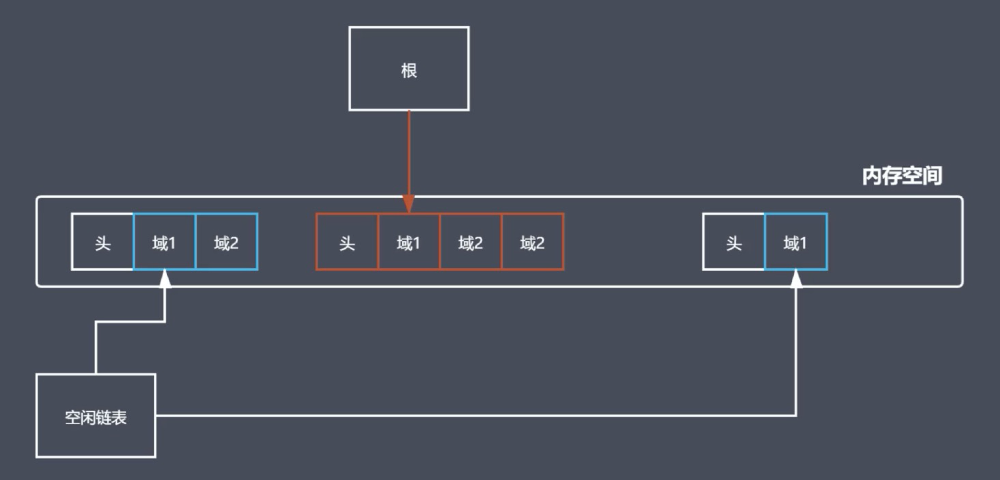
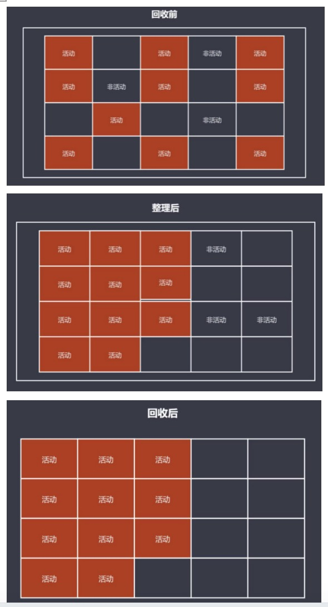
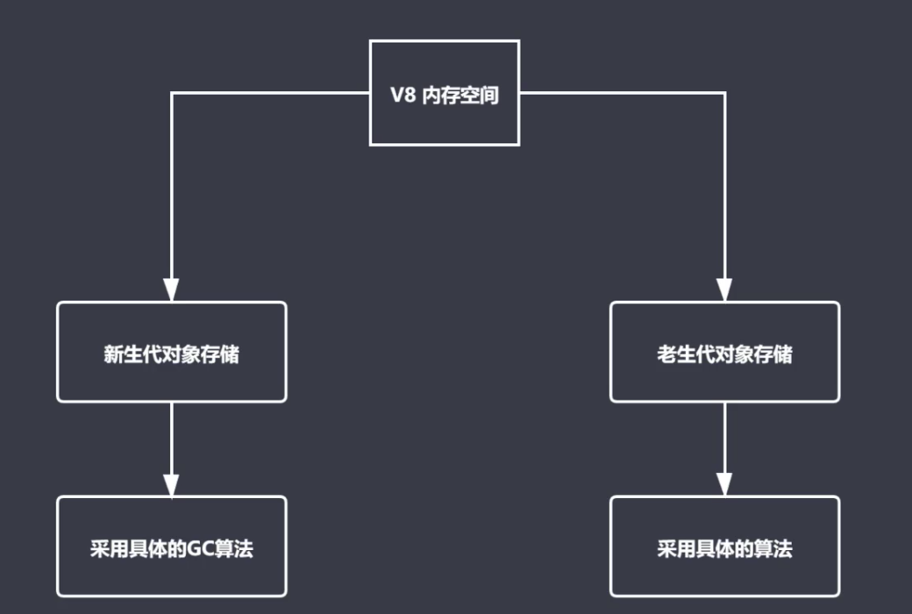
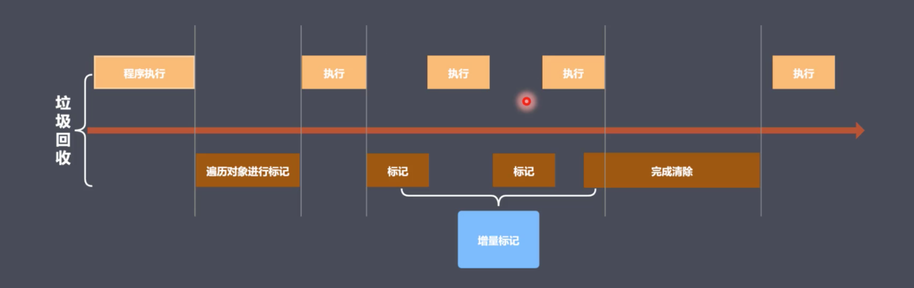

1. JS 中的内存管理：申请内存空间；使用内存空间；释放内存空间

2. JS 中的垃圾

   1. JS 中内存管理是自动的
   2. 对象不在被引用时是垃圾
   3. 对象不能从根上访问到时是垃圾

3. JS 中的可达对象

   1. 可以访问到的对象就是可达对象（引用、作用域链）
   2. 可达的标准就是从根出发是否能被找到
   3. JS 中的根可以理解为是全局变量对象

4. GC 定义与作用

   1. 垃圾回收机制，垃圾回收器完成具体的工作
   2. 可以找到内存中的垃圾，并释放和回收空间
   3. GC 算法是工作时查找和回收所遵循的规则

5. GC 算法

   1. 引用计数

      1. 设置引用数，判断当前引用数是否为 0

      2. 引用计数器

      3. 引用关系改变时修改引用数字（+ -）

      4. 引用数字为 0 时立即回收

      5. 优点

         1. 发现垃圾时立即回收
         2. 最大限度减少程序暂停

      6. 缺点

         1. 无法回收循环引用对象

         2. 时间开销大

         3. ```js
            function fn() {
              const obj1 = {};
              const obj2 = {};
              obj1.name = obj2;
              obj2.name = obj1;
              return "";
            }
            //	按理说全局上找不到obj1,obj2，所以应该回收，但存在互相引用，引用计数不为0，未被回收
            fn();
            ```

   2. 标记清除

      1. 核心思想：分标记和清除两个阶段完成
      2. 遍历所有对象找标记活动对象（如果有引用层次，会进行递归；对于上例函数体内互相引用，因为无法从根上访问到，所以不会被标记）
      3. 遍历所有对象清除没有标记对象
      4. 回收相应空间
      5. 优点：解决循环引用问题
      6. 缺点：空间碎片化
         1. 

   3. 标记整理

      1. 可以看做是标记清除的增强
      2. 标记阶段操作和标记清除一致
      3. 清除阶段会先执行整理，移动对象位置
      4. 

   4. 分代回收

6. V8

   1. 主流的 js 执行引擎
2. 采用即时编译
   
   3. V8 内存设限
4. 回收策略
   
   1. 采用分代回收的思想
      2. 内存分为新生代，老生代
   3. 
   
      4. V8 中常用 GC 算法
         1. 分代回收
      2. 空间复制
         3. 标记清除
         4. 标记整理
         5. 标记增量
   5. 内存分配： From, To, 老生代存储区
      1. 小空间用于存储新生代对象（32M | 16M）
      2. 新生代指的是存活时间较短的对象，比如局部
4. 新生代对象回收实现
      1. 回收过程采用**复制算法 + 标记整理**
      2. 新生代内存区分为两个等大小的空间
      3. 使用空间为From，空闲空间为To
      4. 活动对象存储于From空间
      5. 标记整理后将活动对象拷贝至To
      6. From与To交换空间完成释放
      7. 回收细节说明
         1. 拷贝过程中可能出现晋升
         2. 晋升就是将新生代对象移动至老生代
         3. 一轮GC还存活的新生代需要晋升
         4. To空间的使用率超过25%
   5. 老生代对象说明
      1. 存放在右侧老生代区域
      2. 64位操作系统1.4G，32位700M
      3. 老生代对象就是指存活时间较长的对象
   6. 老生代对象回收实现
      1. 主要采用**标记清除、标记整理、增量标记**算法
      2. 首先使用标记清除完成垃圾空间的回收
      3. 采用标记整理进行空间优化
      4. 采用增量标记进行效率优化
      5. 细节对比
         1. 新生代区域垃圾回收使用空间换时间
         2. 老生代区域垃圾回收不适合复制算法
      6. 标记增量如何优化垃圾回收
         1. 
   
   
   
   
