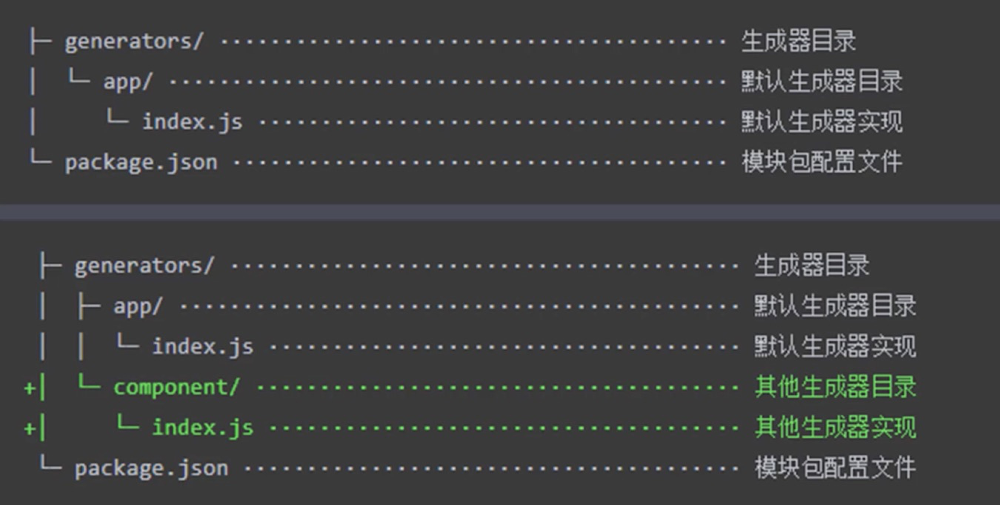

1. 一切重复的工作都应该被自动化

   1. 创建项目
      1. 创建项目结构
      2. 创建特定类型文件
   2. 编码
      1. 格式化代码
      2. 校验代码风格
      3. 编译/构建/打包
   3. 预览/测试
      1. Web Server/Mock
      2. Live Reloading/HMR
      3. Source Map
   4. 提交
      1. git hooks
      2. lint-staged
      3. 持续集成
   5. 部署
      1. CI/CD
      2. 自动发布

2. 脚手架（如vue-cli）更多的是工程化的集成，而不单单只是创建项目模板

3. Yeoman

   1. 比vue，react，ag脚手架更为通用，可根据不同的generator创建不同的项目

      1. 全局安装yo
      2. 安装对应的generator，如generator-node
      3. 通过yo运行generator

      ````js
      yo node
      ````

   2. 有时候只需要在已有项目上添加一些特定类型的文件，可以用到sub generator

      1. 比如添加一个cli工具：yo node:cli
      2. 全局使用的话需要yarn link
      3. 生成后可以全局使用，如my-module --help
      4. 不是每个generator都有sub generator，需在官网查看

   3. 使用步骤

      1. 明确需求
      2. 找到合适的generator
      3. 全局范围安装找到generator
      4. 通过yo运行对应的generator
      5. 通过命令行交互填写选项
      6. 生成所需要的项目结构

   4. 自定义generator

      1. 本质上就是一个npm模块

      2. 基本结构
         
         1. 
         2. image/generator.jpg)
         
      3. 名字格式为generator-xxx

      4. ````js
         yarn init
         yarn add yeoman-generator //	提供基类，内含工具函数
         创建generators/app/index.js // 入口，需要导出一个继承自Yeoman Generator的类型，在工作时会自动调用此类型中定义的一些生命周期方法
         创建模板文件generators/app/template //	遵循ejs模板语法
         写文件Generator类中的writing方法，命令行交互，使用prompting方法
         ````

      5. 创建Vue项目模板

         1. 在上面基础上，将所需要的基本项目结构拷贝至templates文件夹下

         2. 在writing方法里，把每一个文件都通过模板转换到目标路径

            ```js
            writing () {
              const templates = [
                'filePath1',
                'filePath2',
                ...
              ]
              templates.forEach(item => {
               	this.fs.copyTpl(
                	this.templatePath(item),
                  this.destinationPath(item),
                  this.answers
                ) 
              })
            }
            ```

            

      6. 发布Generator和发布一个npm模块一样，用npm publish

4. Plop：更小而美

   1. 适用于组件模板

   2. 将plop作为项目开发依赖安装

   3. 在根目录下创建plopfile.js，其中定义脚手架任务

   4. 编写用于生成特定类型文件的模板

   5. 通过plop提供的CLI运行脚手架任务

      ```js
      module.exports = plop => {
        plop.setGenerator('component', {
          description: 'create a component',
          prompts: [
            {
              type: 'input',
              name: 'name',
              message: 'component name',
              default: 'newComponent'
            }
          ],
          actions: [
            {
              type: 'add', // 代表添加文件
              path: 'src/components/{{name}}/{{name}}.js',
              //	hbs模板文件，适用于其他文件类型，如css,test文件
              templateFile: 'plop-templates/component.hbs',
            }
            //  同理其他类型的文件也可添加action
          ]
        })
      }
      ```

5. 脚手架的工作原理

   1. 创建node命令行程序

      1. 首先npm init，根目录下创建cli.js，里面为cli内容
      2. 在文件头加上\#!/usr/bin/env node，表示文件的执行环境为本地的node，另外，新文件通常不可被直接执行，需要**chmod +x cli.js**，进行权限修改，操作完，可以直接./cli.js执行该文件
      3. 至此，将一个js文件转换成了node的命令行脚本，可以进一步将其打包，集成到package里，这里用到了bin字段，which is a map of command line to local file name。如bin: { "my-cli": ''./cli.js" }
      4. npm link可以使其全局使用,  > my-cli

   2. Inquirer模块获取命令行交互信息，ejs模板引擎

      ```js
      #!/usr/bin/env node
      
      const path = require('path')
      const fs = require('fs')
      const inquirer = require('inquirer')
      const ejs = require('ejs')
      inquirer.prompt([
        {
          type: 'input',
          name: 'name',
          message: 'Project name'
        }
      ]).then(answers => {
        //  模板目录
        const tempDir = path.join(__dirname, 'templates')
        //  目标目录
        const destDir = process.cwd()
      
        fs.readdir(tempDir, (err, files) => {
          if (err) throw err
          files.forEach(file => {
            ejs.renderFile(path.join(tempDir, file), answers, (err, result) => {
              if (err) throw err
              fs.writeFileSync(path.join(destDir, file), result)
            })
          })
        })
      })
      ```

      


