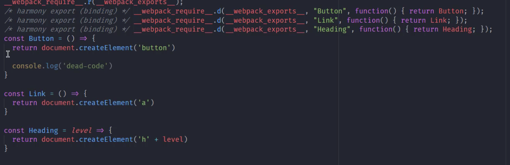

1. 模块打包工具的由来

   1. ESM存在环境兼容问题
   2. 模块文件过多，网络请求频繁
   3. 所有前端资源都需要模块化

2. webpack有个none模式，没有任何优化操作

3. 图片资源既可以用file-loader进行单独处理，也可以用url-loader当做url资源处理

4. 小文件使用Data URLs，减少请求次数；大文件单独提取存放，提高加载速度

5. 常用加载器分类：

   1. 编译转换类：css-loader
   2. 文件操作类：file-loader
   3. 代码检查类：eslint-loader

6. webpack模块加载方式

   1. 遵循ESM标准的import声明
   2. 遵循CJS标准的require函数
   3. 遵循AMD标准的define函数和require函数；
   4. *loader加载的非JS也会触发资源加载，如样式代码中的@import指令和url函数
   5. *html代码中图片标签的src属性

7. loader

   1. 自定义loader时，如果返回的不是js代码，会提示`You may need an additional loader to handle the result of these loaders`，所以，要么这个loader返回一段js代码，要么再去pipe其他的loader再做进一步的转换

   2. 返回js:

      ```js
      const marked = require("marked");
      
      module.exports = (source) => {
        const html = marked(source);
      
        return `module.exports = ${JSON.stringify(html)}`;	可
      }; 
      
      //	bundle.js
      (function(module, exports) {
      
      module.exports = "<h1 id=\"markdown\">markdown</h1>\n<p>texttext</p>\n"
      
      /***/ })
      
      // 改为export default也可
       (function(module, __webpack_exports__, __webpack_require__) {
      
          "use strict";
          __webpack_require__.r(__webpack_exports__);
          /* harmony default export */ __webpack_exports__["default"] = ("<h1 id=\"markdown\">markdown</h1>\n<p>texttext</p>\n");
      
      /***/ })
      
      ```

   3. 交给下个loader: 

      ```js
      rules: [
            {
              test: /.md$/,
              use: [
                'html-loader',
                './markdown-loader'
              ]
            }
          ]
      //	结果
      /***/ (function(module, exports) {
      
      // Module
      var code = "<h1 id=\"markdown\">markdown</h1>\n<p>texttext</p>\n";
      // Exports
      module.exports = code;
      
      /***/ })
      
      ```

8. Plugins通过钩子机制实现

   1. 基于tapable。需要触发的地方，调用call方法，需要监听的地方，调用tap

   2. 插件会获取一个compiler传参，里面包含了配置信息以及多个钩子

   3. 插件必须得是我一个函数或者包含apply方法的对象

   4. 默认打包出来的js会有很多*号，这里写个插件去掉它们
   
      ```js
      class MyPlugin {
        apply(compiler) {
          console.log("plugin start");
          compiler.hooks.emit.tap("MyPlugin", (compilation) => {
            //  compilation => 可以理解为此次打包的上下文
            for (const name in compilation.assets) {
              if (name.endsWith(".js")) {
                const contents = compilation.assets[name].source()
                const withoutCommnets = contents.replace(/\/\*\*+\*\//g, '')
                compilation.assets[name] = {
                  source: () => withoutCommnets,
                  size: () => withoutCommnets.length
                }
              }
            }
          });
        }
   }
      ```

   5. --watch，webpack自带监视功能，即可以更新dist目录，再搭配类似browser sync这样的插件，监听dist目录，即可完成常规的实时更新功能。但这里涉及到两次I/O读写，效率低

   6. dev server集成了自动编译与自动刷新浏览器等功能，提供了cli直接使用。直接`yarn webpack-dev-server`时，会自动打包并监听，打包结果存放在内存中。在开发阶段，静态资源一般都不需要copy插件复制到dist目录下，避免每次更新频繁重复执行打包任务（生产环境需要），所以这里需要单独配置下devServer中的contentBase去额外为开发服务器指定查找资源目录

   7. 一般项目都是同源部署，所以不需要开CORS，但本地存在开发阶段接口跨域问题
   
      ```js
      devServer: {
        proxy: {
          '/api': {
            target: 'https://api.github.com',
              pathRewrite: {
                '^/api': ''
              },
              changeOrigin: true
          }
        }
   }
      ```

   8. #### 问题：为什么cors，本地通过changeorigin就可以绕过限制(涉及到主机名概念)

   9. 几种sourcemap区别
   
      1. eval：不会生成sourcemap，只能定位文件
      2. eval-source-map：生成sourcemap，可定位到具体行列
      3. cheap-eval-source-map：只能定位到行
      4. cheap-module-eval-source-map：与上一个比，也是定位行，但和源文件一模一样，上一个复原的文件是经过loader转换过的
      5. inline-souce-map：嵌入到代码中，不推荐
   6. hidden-source-map：生成了文件，但没通过注释方式引入，常用于第三方包（需要用的时候手动引入）
      7. nosource-source-map：能看到错误位置，但不展示源代码，常用于生产

   10. 总结：
   
      1. eval-是否使用eval执行模块代码
   2. cheap-souce-map: sourcemap是否包含行信息
      3. module- 是否能够得到loader处理之前的源代码

   11. 开发模式：cheap-module-eval-source-map。理由：
   
       1. 代码规范下，每行字符不会很多，能定位到行就ok
    2. 其次会用到很多框架，会经过很多loader处理，转换后差异较大
       3. 首次打包速度慢无所谓，重写打包相对较快

   12. 生产模式：none。理由：Source Map会暴露源代码，调试是开发阶段的事情。或者选nosources模式

   13. devserver的监听导致浏览器刷新，会导致页面状态的丢失，如何做到不刷新的前提下，模块也可以及时更新——热更新

   14. 使用：webpack-dev-server --hot。或在配置文件中
   
       ```js
       const webpack = require('webpack')
       ...
       devServer: {
         hot: true
       }
       ...
    new webpack.HotModuleReplacementPlugin()
       ```

   15. webpack中的HMR并不可以开箱即用，需要手动处理模块热替换逻辑，仅上面的配置，只有样式可以正常HMR（因为style-loader里已经自动处理了热更新），JS还不行（因为JS模块较为复杂，不能像css一样直接覆盖），一些框架或脚手架内可能也支持JS的自动HMR，原因是框架内的模块有规律，有比较方便的HMR方案，或者内部集成了HMR方案

   16. 处理JS模块热替换demo
   
       ```js
       import createEditor from './editor'
       const editor = createEditor()
       document.body.appendChild(editor)
       ...
       
       //	以下用于处理HMR，与业务代码无关
       let lastEditor = editor
       module.hot.accept('./editor', () => {
         const value = lastEditor.innerHTML
         document.body.removeChild(lastEditor)
         newEditor.innerHTML = value
         document.body.appendChild(newEditor)
         lastEditor = newEditor
       })
    //	此时，有输入的状态下，输入文本会被保存下来。但同时也说明了，JS模块更新逻辑不一样，没有通用的方案
       ```

   17. 图片模块的热替换
   
       ```js
       module.hot.accept('./better.png', () => {
       	img.src = background
    })
       ```

   18. 大部分框架里都有成熟的HRM方案，这里是纯原生的方式，所以会有点麻烦

   19. HRM注意事项
   
       1. 处理HMR的代码报错会导致自动刷新，错误信息刷新后消失，这种情况可以将`hot: true`改为`hotOnly: true`
    2. 没启用HMR的情况下，HMR API报错，解决办法：相关代码加上`if (module.hot)`判断即可
       3. build过程中，如果没开启HMR，是不会把相关代码打包进去的

   20. webpack不同环境下的配置

       1. 配置文件根据环境不同导出不同配置
   
          ```js
          module.exports = (env, argv) => {	// 支持函数模式
          	const config = {} //	省略
            if（env === 'production'）{
              config.mode === 'production'
              config.devtool = false
              config.plugins = [
                ...config.plugins,
                new CleanWebpackPlugin(),
                new CopyWebpackPlugin(['public'])
              ]
            }
          }
       //	webpack --env production
          ```

          

       2. 一个环境对应一个配置文件(适合大型项目)

          就是有三个文件，一个common的配置，一个dev，build的配置，在后两者中进行merge，考虑到普通的merge一般用Object.assign，不方便操作对象数组的merge，可用webpack-merge合并

   21. DefinePlugin: 为代码注入全局成员，常见的如`process.env.NODE_ENV`,第三方模块用的比较多。原理是在构建过程中，直接将值替换所用到的key

   22. webpack在production mode下自动开启tree-shaking，在none模式下，可在config中配置
   
       ```js
       optimization: {
         usedExports: true, // 不会将未用到的代码加到模块exports里，见下
         minimize: true, // 打包时去掉上一步中的未用到的代码
    }
       ```

       如果只用到Button，第二第三行usedExports会去掉，minimize后，下面的Link和Heading也会去掉

       

   23. 普通的打包将每个模块放在一个单独的函数当中，可以concatenateModules合并，提升运行效率，减少体积

   24. 有资料说babel会导致tree-shaking失效：TS前提是ES Modules，也就是由Webpack打包的代码必须使用ESM，而为了转换ESM中的新特性，会用到babel-loader，而最新的babel-loader中自动关闭了转换ESM的插件，因此TS可以正常使用。如果在babel配置中强制开启转换，如转换成`['@babel/preset-env': {modules: 'commonjs'}]`后，TS会失效

   25. 副作用：模块执行时除了导出成员之外所做的事情。sideEffects一般用于npm包标记是否有副作用，开启方法为optimization中的sideEffects: true，生产模式默认开启，然后在package.json中加入sideEffects: false，表面项目中代码没有副作用。这样没用到的模块会被移除

   26. 对于一些有副作用的模块，如css模块，或者js模块如 `import xxx.js`，xxx中对Number原型链进行了修改（副作用代码），那么应该在package.json中的sideEffects配置不需要处理的文件路径

   27. Code Splitting
   
    1. 多入口打包：多页配置
       2. 动态导入：动态导入的模块会被自动分包

   28. 魔法注释：在动态导入的地方加入注释，可自定义chunk名。如果用了同一个name，则会被打包到一起
   
       ```js
       if (xxx) {
         import(/* webpackChunkName: 'posts' */ './post/posts').then(({default: posts}) => {
           
         })
    }
       ```

   29. MiniCssExtractPlugin可单独提取css文件，注意需要替换掉style-loader。搭配OptimzieCssAssetsWebpackPlugin进行压缩
   
   30. 三种哈希：hash, chunkhash, contenthash
