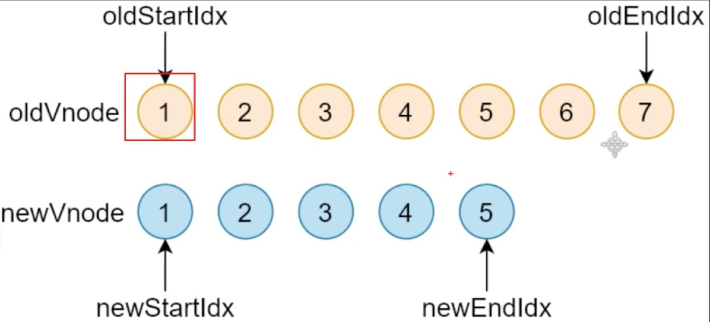

1. h函数

   1. ```js
      var vnode = h('div#container.two.classes', 
                    { on: { click: someFn } }, 
                    [
        h('span', { style: { fontWeight: 'bold' } }, 'This is bold'),
        ' and this is just normal text',
        h('a', { props: { href: '/foo' } }, 'I\'ll take you places!')
      ])
      ```

   2. 使用了"重载"，即支持不同数量/类型的参数

   3. 对第二、三个参数进行类型判断，内部赋值了data，即module配置，children，text，子节点，返回`vnode(sel, data, children, text, elm)`

2. vnode函数

   1. ```js
      export interface VNode {
        sel: string | undefined //选择器
        data: VNodeData | undefined //节点数据：属性/样式/事件等
        children: Array<VNode | string> | undefined //子节点，和text只能互斥
        elm: Node | undefined //记录vnode对应的真实dom
        text: string | undefined //节点内容，和children只能互斥
        key: Key | undefined // 优化用
      }
      
      
      export function vnode 
      (
      	sel: string | undefined,
        data: any | undefined,
        children: Array<VNode | string> | undefined, 
        text: string | undefined, 
        elm: Element | Text | undefined 
      ): VNode {
        const key = data === undefined ? undefined : data.key
        return { sel, data, children, text, elm, key }
      }
      
      ```

3. patch函数

   1. vnode函数只是返回了一个对象，patch才是核心内容
   2. patch(oldVnode, newVnode)，把新节点中变化的内容渲染到真实DOM，最后返回新节点作为下一次处理的旧节点
   3. 对比新旧vnode是否相同节点（key, sel相同）
   4. 不同，则删除之前的内容，重新渲染
   5. 相同，再判断vnode是否有text，如果有并且和oldVnode的text不同，直接更新文本内容
   6. 如果新的vnode有children，判断子节点是否有变化，这个过程用到diff算法
   7. diff过程只进行同层级的比较

   ```js
   export function init (modules: Array<Partial<Module>>, domApi?: DOMAPI) {
      const cbs: ModuleHooks = {
       create: [],
       update: [],
       remove: [],
       destroy: [],
       pre: [],
       post: []
     } // 每个module其实就是一个对象，里面包含若干个上面的hook，这里会将modules遍历，将每个里面各个hook，push到cbs对应hook的数组中
     ...
     function emptyNodeAt (elm: Element) {}
     function createRmCb (childElm: Node, listeners: number) {}
     function createElm (vnode: VNode, insertedVnodeQueue: VNodeQueue): Node {}
     function addVnodes{}
     function invokeDestroyHook (vnode: VNode){}
     function removeVnodes (...) {}
     function updateChildren(...) {}
     function patchVnode(...) {}
     return  function patch (oldVnode: VNode | Element, vnode: VNode): VNode {
      	// 现将pre hook中的函数遍历执行
       let i: number, elm: Node, parent: Node
       const insertedVnodeQueue: VNodeQueue = []
       for (i = 0; i < cbs.pre.length; ++i) cbs.pre[i]()
       // 如果oldVnode不是vnode(无sel)，有可能是真实dom节点，将其创建成vnode并设置elm
       if (!isVnode(oldVnode)) {
         oldVnode = emptyNodeAt(oldVnode)
       }
       if (sameVnode(oldVnode, vnode)) {
         //找差异，更新dom
         patchVnode(oldVnode, vnode, insertedVnodeQueue)
       } else {
         elm = oldVnode.elm!
         parent = api.parentNode(elm) as Node
         // 转换为真实vnode（vnode中添加elm）
         createElm(vnode, insertedVnodeQueue)
         if (parent !== null) {
           api.insertBefore(parent, vnode.elm!, api.nextSibling(elm))
           removeVnodes(parent, [oldVnode], 0, 0)
         }
       }
   
     }
   }
   ```
 1. `createElm(vnode, insertedVnodeQueue)`
   
      1. 将vnode转换成对应的dom元素（未插入）
      2. 执行data中用户定义的init钩子
      3. 如果sel是!，vnode.elm赋值为注释节点，并返回vnode.elm
      4. 如果sel有值，对其解析出hash，dot，tag，`api.createElement(tag)`创建元素，并根据hash, dot，设置id, class
      5. 执行cbs中的create钩子
      6. 对children判断，数组，则遍历，并执行`api.appendChild(elm, createElm(ch as VNode, insertedVnodeQueue))`；如果是普通值，则当文本节点`api.appendChild(elm, api.createTextNode(vnode.text))`
      7. 执行data中的create hook，如果还有insert hook，则`insertedVnodeQueue.push(vnode)`
      8. 其他情况，默认是文本节点，`vnode.elm = api.createTextNode(vnode.text!)`
   
   2. `patchVnode(oldVnode, vnode, insertedVnodeQueue)`
   
      1. 触发prepatch，update钩子函数
      2. 新节点有text属性，且不等于旧节点text属性
         1. 如果旧节点有children，移除对应DOM
         2. 设置新节点对应DOM元素的textContent
      3. 新老节点都有children，且不等
         1. 调用updateChildren()
         2. 对比子节点，并且更新子节点的差异
      4. 只有新节点有children属性
         1. 如果老节点有text属性，清空对应DOM元素的textContent
         2. 添加所有的子节点
      5. 只有老节点有children属性，移除所有老节点
      6. 只有老节点有text属性，清空对应DOM元素的textContent
      7. 触发postpatch钩子
   
   3. ##### updateChildren（diff重点）
   
   4. 
   
      1. 开始节点与结束节点比较，这两种情况类似
         1. oldStartVnode/newStartVnode
         2. oldEndVnode/newEndVnode
         3. 举例：如果oldStartVnode和newStartVnode是sameVnode(key, sel相等)，调用patchVnode对比和更新节点。把新旧的开始索引都往后移动，oldStartIndex++, oldEndIndex++
         4. end节点同理，index--
      2. 旧开始节点/新结束节点比较（左上角到右下角），如果相同，patchVnode，将旧开始节点移动至最后，oldStartIndex++，newEndIndex--
      3. 反之亦然，右上角到左下角，相同，则旧结束节点移动至第一个位置，oldEndIndex--, newStartIndex++
      4. 以上四种情况都没找到，则在oldVnode中寻找与newStartNode具有相同key值的节点
         1. 没找到，说明是个新节点，创建新的DOM元素，并插入到oldVnode最前面
         2. 找到了
            1. 判断新老节点sel选择器是否相同。不同，说明被修改，重新创建对应的DOM并插入
            2. 相同，把oldVnode中对应的elmToMove移动到最前面
      5. 循环结束
         1. 当老节点遍历完，即oldStartIndex > oldEndIndex；说明新节点还有剩余，把剩余节点批量插入到oldVnode右边
         2. 当新节点遍历完，即newStartIndex > newEndIndex；说明老节点有剩余，把剩余节点批量删除
   
   5. 带key和不带key的区别：不带key的时候，sel和key(undefined)都相等的情况下，也就是新老节点为sameVnode，会走patchVnode流程，更新内容。带key的时候，会走其他流程（新老节点不为same，会进行查找），进行排序而不是修改内容