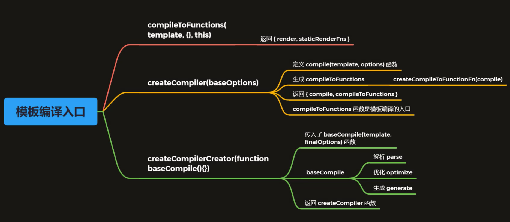

1. 模板编译的作用

   1. vue2.x使用VNode描述视图以及各种交互，用户自己编写VNode比较复杂
   2. 用户只需要编写类似HTML的代码-vue.js模板，通过编译器将模板转换为返回VNode的render函数
   3. .vue文件会被webpack在构建的过程中转换成render函数

2. 生成的的render函数，大概是这样

   ```html
   <div id="app">
     <h1>Vue<span>123</span></h1>
     <p>{{msg}}</p>
     <comp @myclick="handler"></comp>
   </div>
   ```

   对应的：

   ```js
   (function anonymous() {
     with(this) {
       return _c(
       	"div",
         { attrs: {id: 'app'}}, // 属性
         [ // 子元素
           _m(0),
           _v(" "),
           _c("p", [_v(_s(msg))]),
           _v(" "),
           _c("comp", {on: { myclick: handler }})
         ],
         1 // 将children拍平
       )
     }
   })
   ```

   \_c在src/core/instance/render.js中，就是_createElement（vm.$createElement是用户自己写的render函数，和vm.\_c的区别在于最后一个参数，一个为true一个false）

   \_m, \_v, \_s在src/core/instance/render-helpers/index.js中

   _m: renderStatic

   _v: createTextVNode

   _s: toString

3. render函数由`const { render, staticRenderFns } = compileToFunctions(template, {...})`生成

4. compileToFunctions由`const { compile, compileToFunctions } = createCompiler(baseOptions)`生成

   

5. 编译入口逻辑之所以这么绕，是因为 Vue.js 在不同的平台下都会有编译的过程，因此编译过程中的依赖的配置 `baseOptions` 会有所不同。而编译过程会多次执行，但这同一个平台下每一次的编译过程配置又是相同的，为了不让这些配置在每次编译过程都通过参数传入，Vue.js 利用了函数柯里化的技巧很好的实现了 `baseOptions` 的参数保留。同样，Vue.js 也是利用函数柯里化技巧把基础的编译过程函数抽出来，通过 `createCompilerCreator(baseCompile)` 的方式把真正编译的过程和其它逻辑如对编译配置处理、缓存处理等剥离开，这样的设计还是非常巧妙的。

----

1. 为什么要使用抽象语法树
   1. 模板字符串转换成AST后，可以通过AST对模板做优化处理
   2. 标记模板中的静态内容，在patch的时候直接跳过静态内容
   3. 在patch的过程中静态内容不需要对比和重新渲染
2. parse
   1.  `const ast = parse(template.trim(), options)`
   2. parse中，调用了parseHTML
      1. `parseHTML(template, {..., start(){}, end(){}, chars(){}, comment(){}})`，传入了一些解析过程中的回调函数，比如start，就是匹配了开始标签后的回调，在里面创建了一个ast对象，同时解析一些vue的指令如v-if，记录在这个对象上
      2. 该函数中，定义了各种正则，用于匹配属性，标签等
      3. 在处理html文本的过程中，对html进行while循环，一个个正则去匹配，匹配成功，则会把处理完的文本，截取，然后continue，继续处理剩余的（下一个html循环）
3. optimize
   1. markStatic
      1. 用于标记ast中的静态节点，即永远不需要更改的DOM，以便后续patch的时候可跳过，赋值给node.static，条件：
         1. node.type为2，说明是文字表达式，不可
         2. node.type为3，说明是文本，可
         3. node.pre（v-pre），可
         4. 同时满足不是动态绑定，不是v-if，v-for，不是内置组件等等，可
      2. 遍历node的children，对children进行markStatic遍历处理，如children不满足，则该node的static属性也会置为false
   2. markStaticRoots
      1. 用于标记静态根节点
      2. 如果为元素节点，即node.type为1
         1. 如果经过markStatic标记该节点为static，且，含有子节点，且非只含有一个文本节点的情况，node.staticRoot = true，最后一个非文本节点的限制是因为这种情况，优化的cost大于收益
      3. 下面和markStatic一样，对子节点进行遍历
4. generate
   1. `const code = generate(ast, options)`，把优化好的ast转换成js代码
   2. 核心是genElement函数，里面结合ast的属性，与字符串形式的_c, _v等方法，拼接生成代码字符串

----


----

1. 组件化

   1. 在core/global-api/assets中

      ```js
      if (type === 'component' && isPlainObject(definition)) {
        definition.name = definition.name || id
        definition = this.options._base.extend(definition)
      }
      this.options[type + 's'][id] = definition
      ```

   2. 主要看Vue.extend，在core/global-api/extend.js中

   3. 组件的构造函数Sub继承自Vue的构造函数，返回的是一个Sub类。并将该类保存

   4. 在Vue的初始化过程(_init)中，会用到createElement，在里面会判断tag是否为string，不是的话则为component，会调用`vnode = createComponent(tag, data, context, children)`

   5. createComponent中，会调用installComponentHooks注册一些钩子函数（源码中预定义的和用户传入的），其中init钩子中创建了组件对象，createComponent返回的是new VNode。也就是把组件转换成了VNode对象。

   6. 在patch函数中，执行了init钩子，也就是执行了Vue中的_init函数，因此该方法中也有一些关于实例化组件的函数，比如定义父子关系

   7. 组件的创建过程，先父后子，组件的挂载过程，先子后父