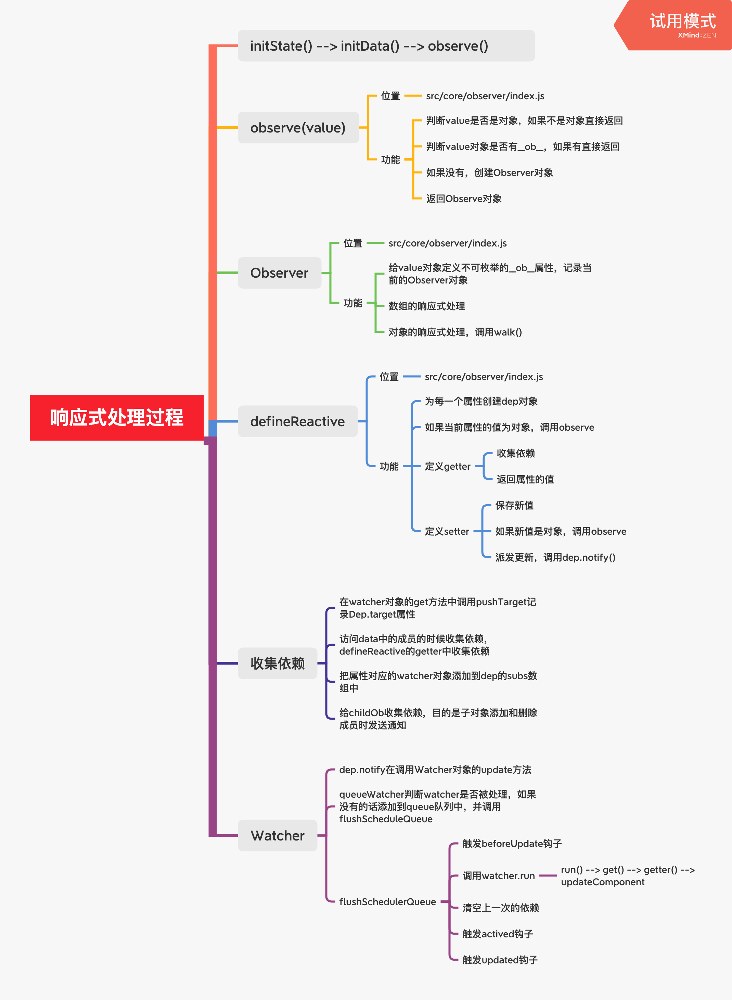

1. vue2利用Flow的静态类型检查，通过静态类型推断实现（编译阶段）

2. vue源码的打包工具，使用的是rollup，比webpack轻量（Rollup只处理js，更适合在库中使用，也不会生成冗余代码）

3. |                           |                    |       CommonJS        |                 ES Module                  |
   | ------------------------- | :----------------: | :-------------------: | :----------------------------------------: |
   | Full                      |       vue.js       |     vue.common.js     |                 vue.esm.js                 |
   | Runtime-only              |   vue.runtime.js   | vue.runtime.common.js | vue.runtime.esm.js （vue cli所使用的版本） |
   | Full (production)         |     vue.min.js     |                       |                                            |
   | Runtime-only (production) | vue.runtime.min.js |                       |                                            |

4. 
   1. 完整版：同时包含编译器和运行时版本
   2. 编译器compiler：用来将模板字符串编译成JS渲染函数的代码，体积大，效率低
   3. 运行时runtime：用来创建Vue实例，渲染并处理虚拟DOM等代码，体积小，效率高
   4. 如果使用了runtime-only版本，却又写的template，vue会报错：either pre compile the templates into render functions, or use the compiler-included build.
   5. UMD：UMD版本通用的模块版本，支持多种模块方式。vue.js默认文件就是运行时+编译器的UMD版本
   6. CJS：CommonJS版本用来配合老的打包工具比如browserify或webpack1
   7. ESM：从2.6开始Vue会提供两个ESM构建文件，为现代打包工具提供的版本

----

1. 分析full版本vue.js
   1. 从**src/platform/web/entry-runtime-with-compiler.js**入口开始
      1. **重写**了平台相关的$mount方法
      2. el不能是body或者html标签
      3. 如果没有render，**把template转换成render函数**，还有一个staticRenderFns，都会挂载到options下
      4. 如果有render方法，直接调用mount挂载DOM（该mount是runtime/index，也就是下面2中定义的mount）
      5. 注册了Vue.compile方法，传递一个HTML字符串返回render函数
   2. **src/platforms/web/runtime/index.js**
      1. 被上面所引用（`import Vue from './runtime/index'`）
         1. entry-runtime入口也是直接引用的该文件 
      2. 注册和平台相关的全局指令：v-model、v-show
      3. 注册和平台相关的全局组件：v-transition、v-transition-group
      4. 全局方法
         1. \__patch__: 把虚拟DOM转换成真实DOM
         2. $mount: 挂载方法
   3. **src/core/index.js**
      1. 被上面所引用（`import Vue from 'core/index'`）
      2. 与平台无关
      3. 设置了Vue的静态方法和属性
         1. initGlobalAPI(Vue)
            1. Vue.options[components/directives/filters] = Object.create(null)
            2. extend(Vue.options.components, builtInComponents)，只是简单的添加属性，添加了keep-alive组件
            3. initUse(Vue)，注册插件。在Vue上添加use方法，接收一个plugin参数，先看Vue的_installedPlugins上有没有缓存过该plugin，没有则加，如果plugin有install属性且为函数，调用，否则如果本身为函数，调用。
            4. initMixin，在Vue上添加mixin方法，主要是用mergeOptions将参数配置混入到Vue的options配置中
            5. initExtend，在Vue上添加extend方法，返回了一个以Vue为原型的构造函数，一般用于函数式/编程式的自定义组件。[参考掘金文章](https://juejin.im/post/5dd0a028e51d4507fc7252f6)，注意文末与Vue.component的区别。https://juejin.im/post/6844903946088103949
            6. initAssetRegisters，注册directive，component，filter方法。
               1. 三个方法参数一致，都是id，definition(非必传)。
               2. 只传id，表示获取，返回this.options[type + 's']\[id]，参考上面的1
               3. 如果type是component，且definition是个plain object，调用5中定义的Vue的extend(definition)，赋值给definition
               4. 如果是type是directive，且definition是个function，definition={bind: defi, update: defi}
               5. 最后，this.options[type+'s']\[id] = definition。注册了全局的指令或者组件
         2. 设置了config, set, delete, nexttick等静态方法与属性
   4. **src/core/instance/index.js**
      1. 被上面所引用（import Vue from './instance/index'）
      2. 与平台无关
      3. Vue实例所在文件，定义了构造函数，**调用了this._init(options)方法，是vue的核心入口**
      4. 给Vue中混入了常用的实例成员
         1. initMixin：添加Vue.prototype._init
         2. stateMixin: 在原型上注册$data，$prop，$set，$delete，$watch
         3. eventsMixin: 注册$on，$once，$off，$emit
         4. lifecycleMixin：注册_update，$forceUpdate，$destroy
         5. renderMixin：$nextTick，_render

----

1. 上面4中在构造函数㕯，调用了this._init方法，该方法在initMixin中定义

   1. merge了传入的option与之前初始化的构造函数（3中）的option
   2. 定义vm._renderProxy，可能将vm或者Proxy对象赋值给它，设置了渲染时的代理对象
   3. initLifecycle：添加到父组件parent的$children数组中。同时初始化该vm的$parent，$root，$children，$ref等
   4. initEvents：定义_events，获取父组件上附加的事件，注册到当前组件
   5. initRender：定义$slots，$scopedSlots，_c用于将template编译为render函数，$createElement用于手动传入render函数中的h，两者都调用了createElement方法(类似snabbdom中的h函数)，最后一个参数不一样。定义了$attrs和$listeners
   6. callHook：触发beforeCreate函数
   7. initInjections：vue的依赖注入功能，找到$option中的inject的key，从vm的_provided中找到对应的结果（找不到则继续往$parent上找）。找到后defineReactive(vm, key, result[key])，添加到vm上
   8. initState：
      1. initProps，将每个prop进行响应式处理后存在vm._props中，且proxy到vm上方便使用
      2. initMethods，vm[key] = bind(methods[key], vm)
      3. initData，将每个data挂到vm上，并响应式处理
      4. initComputed
      5. initWatch
   9. initProvide：vue的依赖注入功能，将$options中的provide取出，加到vm._provided上
   10. callHook：触发created函数
   11. 调用vm.$mount(vm.$options.el)，挂载页面

2. 看渲染过程，继续从上面的vm.$mount入手

   1. $mount显然是entry-runtime-with-compiler.js中重写的那个

   2. 获取render函数，没有的话，将template（没有的话，通过el获取template）转换成render函数，还有一个staticRenderFns，都会挂载到options下

   3. 调用$mount方法，该方法是定义在runtime/index.js中的那个

      1. 重新获取el，因为有可能是运行时模式直接进来的，紧接着调用**mountComponent**

      2. 在mountComponent中

         1. 判断是否有render函数，不管是full模式还是运行时模式，走到这一步应该都有render函数，没有的话会做相应的提示

         2. 触发beforeMount

         3. 定义`updateComponent = () => { vm._update(vm._render(), hydrating) }`，vm.\_render()会调用用户传入的render或者编译器生成的render，返回虚拟DOM，vm.\_update会将其转化为真实DOM

         4. ```js
            new Watcher(vm, updateComponent, noop, {
              before () {
                if (vm._isMounted && !vm._isDestroyed) {
                  callHook(vm, 'beforeUpdate')
                }
              }
            }, true /* isRenderWatcher */)
            ```

         5. 触发mounted

         6. 执行完后，返回vm

   4. entry-runtime-with-compiler.js中的$mount执行完

3. _init执行完，core/instance/index.js中，Vue的构造函数执行完

----

#### Vue响应式

1. _init中调用了initState方法，里面继续调用initData，其中的observe函数定义了数据的响应式：`observe(data, true /* asRootData */)`

2. observe函数中，如果data中有\__ob__属性，则直接返回，否则`ob = new Observe(data)`并返回

3. Observe是一个类

   1. 每个实例都有一个dep属性，即`this.dep = new Dep()`
   2. ` def(data, '__ob__', this)`，将\__ob__指向Observe类，并添加到监听对象中
   3. 如果接收的是数组
      1. 拦截数组上的原型方法进行改写，相当于将该目标array的原型指向xxx，xxx又是继承自原生Array.prototype，对xxx进行了一些数组方法的改写，每次触发时：
         1. 获取自身的Observe对象，`const ob = this.__ob__`
         2. 对于一些添加了元素的操作，比如push，unshift, splice，将新添加的元素进行observe处理
         3. 调用`ob.dep.notify()`
         4. 返回的结果当然是通过apply取原生方法的结果
   4. 如果接收的是对象，则遍历属性，对每一个进行`defineReactive(obj, keys[i])`处理

4. defineReactive

   1. `const dep = new Dep()`

   2. 如果该属性的属性描述符中，configurable为false，则return，不做处理

   3. 如果不是shallow监听，对属性值进行observe监听，`childOb = !shallow && observe(val)`

   4. 用Object.defineProperty设置getter和setter

      1. getter中

         1. 如果该属性之前用户定义过getter，则调用该getter，否则直接返回value。

         2. 同时收集依赖：

            ```js
            if (Dep.target) { // Watcher对象
            	dep.depend() // Dep.target.addDep(this)
              if (childOb) {
                childOb.dep.depend()
                if (Array.isArray(value)) {
                  dependArray(value)
                }
              }
             }
            ```

            1. `Dep.target.addDep(this)`内部判断了下dep的id，如果该Watcher的newDepIds不含此id（包含则不进行操作），Watcher会保存一份dep，最后`dep.addSub(this)`，又把操作转移到了dep里，让dep添加此Watcher到自己的subs里
            2. 如果子属性的值也是个响应式对象，那么也需要进行dep.depend，因为子属性的改变（添加或删除），理应通知父级的Watcher
            3. 注意这里有两个dep，一个是所有的observe对象都有一个dep，一个是defineReactive中的dep。比如data中有个arr属性，当arr被重新赋值时，调用的是dep.depend的监听，当arr的数组发生变化时，调用的是childOb.dep.depend中的监听
            4. 当数组中有对象，该对象的dep也会depend()，当数组中有数组，则递归调用dependArray

      2. setter中

         1. 先获取旧值。新旧值一样则return不处理，有预先定义的getter没setter，说明只读，也不处理。
         2. 最后有用户定义的setter，则`setter.call(obj, newVal)`，否则直接val = newVal。
         3. 对新值也要进行observe处理，同样也是`childOb = !shallow && observe(val)`。
         4. 最后调用`dep.notify()`

   ---

5. #### Watcher类

   1. 分为三种，Computed Watcher，用户Watcher(侦听器)，渲染Watcher

   2. 渲染Watcher

      ```js
       new Watcher(vm, updateComponent, noop, {
          before () {
            if (vm._isMounted && !vm._isDestroyed) {
              callHook(vm, 'beforeUpdate')
            }
          }
        }, true /* isRenderWatcher */)
      ```

      1. Watcher中，第二个参数为`expOrFn: string | Function`, 当为function时，`this.getter = expOrFn`, 当为字符串时，也就是在用户使用watch时，`this.getter = parsePath(expOrFn)`, 返回了一个函数，获取expOrFn的值
      2. `this.value = this.lazy ? undefined : this.get()` computed计算属性时为lazy
      3. 在get函数中
         1. 先pushTarget(this)，做了两件事，1是将this push到targetStack中，然后Dep.target = this。targetStack的目的是当父子组件嵌套的时候，先把父组件对应的watcher入栈，再去处理子组件的watcher，子组件的处理完毕后，再把父组件对应的watcher出栈，继续操作
         2. 执行getter函数，这个过程中完成了页面的渲染，数据的绑定
      4. 当dep中执行notify，会触发Watcher类中的update方法
         1. 调用queueWatcher(this)
         2. 判断has数组中有没有这个id，没有的话则has[id] = true，往下执行
         3. 如果没在flushing，queue.push(watcher)放入队列
         4. 执行flushSchedulerQueue
            1. 首先flushing置为true
            2. 将queue中的watcher按照id排序，确保：1. 父组件比子组件先更新，因为父组件永远比子组件先被create，2. user watcher（用户的watch任务）比render watcher先更新，因为也是先被create, 3.如果一个组件在父组件的watcher运行时被destroyed，它的watchers可以被跳过
            3. 遍历watcher，如果有watcher.before则调用（beforeUpdate）
            4. watcher.run()，里面调用watcher的get方法，重新收集一次依赖，同上面的3
         5. resetSchedulerState，触发activate和updated钩子函数

   ---

   1. 动态添加一个对象的新属性，不会被监听到变化，直接改数组中的index赋值，也不会。可以用Vue.set或者vm.$set进行动态添加响应式属性
2. 对于数组，其实里面用的是splice方法
   
   3. 检查target上是否有\__ob__对象，有的话`defineReactive(ob.value, key, val)`; `ob.dep.notify()`
4. 例子：data: { obj: { p1: 1 } }，通过`vm.$set(vm.obj, 'p2', 2)`。首先获取到obj的\__ob__对象，这是在defineReactive中的`let childOb = !shallow && observe(val)`定义的，通过ob.value，可以获取到该value，也就是obj，进行上面的defineReactive操作后，发送通知。这里是怎么绑定watcher的呢，是因为渲染函数` new Watcher(vm, updateComponent, noop,...)`这里对vm进行了绑定，vm中，childOb的关系，obj的dep也进行了渲染watcher的绑定，所以可以直接`ob.dep.notify`
   
6. 同理vm.$delete也可以删除对象中的属性(delete)或者数组中的元素(splice)，最后如果是对象的话，同样`ob.dep.notify()`

7. 三种类型的watcher，按照初始化顺序(也是执行顺序)分别是：计算属性Watcher，用户Watcher(侦听器)，渲染Watcher

8. 以侦听器Watcher为例

   1. initWatcher中，获取`handler = watch[key]`
   2. 执行createWatcher(vm, key, handler)，handler既可以是对象，就去获取对象中的handler属性，也可以是字符串，对应的是methods中的方法
   3. 执行vm.$watch(key, handler, options)
      1. options.user = true
      2. `const watcher = new Watcher(vm, expOrFn, cb, options)`
         1. 在Watcher类中，和上面响应式过程一样，通过get方法去绑定响应关系
         2. 计算属性创建Watcher实例时，传入lazy=true，是因为computed属性不需要单独另外求值，在render中会去get值
      3. 判断options中immediate属性，true，则cb.call(vm, watcher.value)

---

$nexttick利用的是微任务特性，根据浏览器兼容，使用promise.resolve或者MutationObserver，或者是setImmediate（最后会选setTimeout，性能比前者差一些）



e

