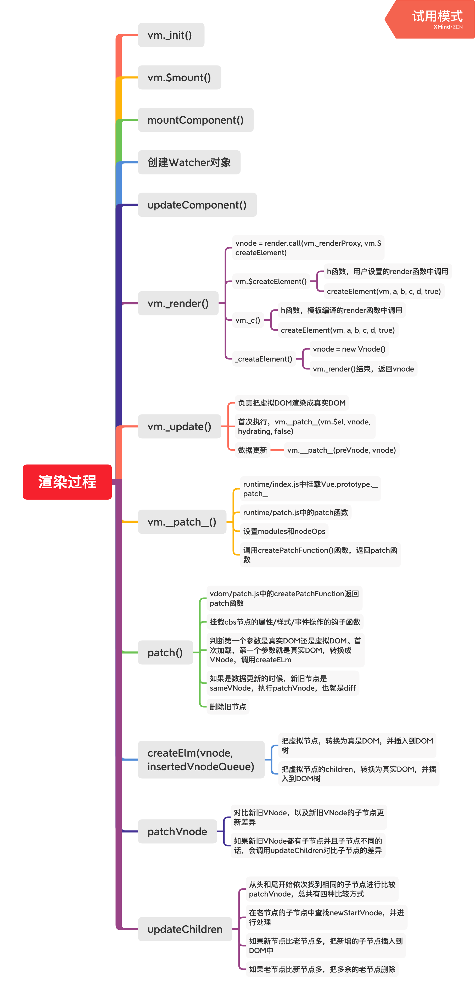

1. 虚拟DOM(virtual DOM)是使用JS对象描述真是DOM

2. 借鉴了Snabbdom，添加了vue的特性，比如指令和组件

3. 为什么使用虚拟DOM
   1. 避免直接操作DOM，提高开发效率
   2. 作为一个中间层可以跨平台
   3. 虚拟DOM不一定可以提高性能
      1. 首次渲染的时候，需要额外维护，会增加开销
      2. 复杂视图情况下提升渲染性能
   
4. h函数
   1. vm.$createElement(tag, data, children, normalizeChildren)
      1. tag：标签名称或者组件对象
      2. data：描述tag，可以设置DOM的属性或者标签的属性
      3. children：tag中的文本内容或者子节点
   2. 返回VNode
      1. tag
      2. data
      3. children
      4. text
      5. elm
      6. key
   
5. 渲染入口是`updateComponent = () => { vm._update(vm._render(), hydrating) }`
   
   1. _render()
      1. vm.\_render生成虚拟DOM，里面执行了`vnode = render.call(vm._renderProxy, vm.$createElement)`
      2. render的第一个参数是h，也就是$createElement
      3. $createElement中只是对不同个数的参数进行一个处理，实际调用的还是`_createElement(context, tag, data, children, normalizationType)`，最后一个参数，如果是调用用户传入的render函数，会将其设置为`ALWAYS_NORMALIZE`，是个值为2的常量。对应有个`SIMPLE_NORMALIZE`为1
      4. `_createElement`内，判断data是否有\__ob__，如果有，则在生产环境下警告应避免使用响应式数据作为data
      5. 如果有的话，将data.is赋值给tag（动态属性相关）
      6. 判断normalizationType，如果是用户传来的，`children = normalizeChildren(children)`，否则，`children = simpleNormalizaChildren(children)`
         1. 在normalizeChildren中，判断children是否是原始值，是的话返回[createTextVNode(children)]，如果是数组的话，返回normalizeArrayChildren(children)
         2. `simpleNormalizaChildren`把二维数组转换成一维数组。。。不是很懂
      7. 判断tag
         1. 是否为html保留标签，是的话返回相应的VNode，
         2. 是否是自定义组件，查找自定义组件构造函数的声明，创建组件VNode
         3. 其他情况，创建正常的VNode
         4. 以上3种情况是tag为字符串时的判断，如果不是字符串，则tag是component，`vnode = createComponent(tag, data, context, children)`
   2. _update()
      1. 核心是根据是否首次渲染，调用了vm.\__patch__
      2. patch.js中。`patch = createPatchFunction({nodeOps, modules})`, nodeOps是一些DOM操作方法，modules由platformModules和baseModules构成，里面是用于操作属性，样式，事件等等，每个里面都定义了VNode生命周期的钩子函数
      3. `createPatchFunction`类似于snabbdom中的init函数，返回了patch函数
   3. patch
      1. 挂载cbs节点的属性/事件/样式操作的钩子函数
      2. 判断第一个参数是真实DOM还是虚拟DOM。首次加载，第一个参数就是真实DOM，转换成VNode，调用createElm
      3. 如果是数据更新的时候，新旧节点是sameVnode执行patchVnode，也就是Diff
      4. 删除旧节点
   
   ----
   
   
   
   