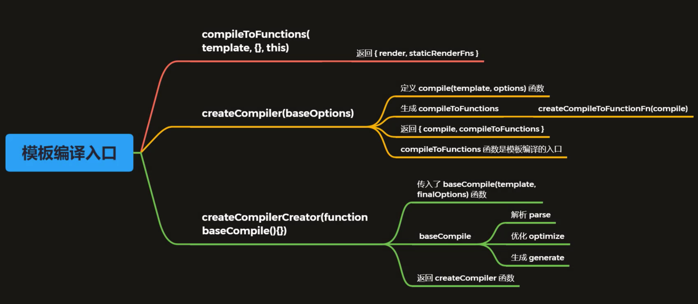

1. 模板编译的作用

   1. vue2.x使用VNode描述视图以及各种交互，用户自己编写VNode比较复杂
   2. 用户只需要编写类似HTML的代码-vue.js模板，通过编译器将模板转换为返回VNode的render函数
   3. .vue文件会被webpack在构建的过程中转换成render函数

2. 生成的的render函数，大概是这样

   ```html
   <div id="app">
     <h1>Vue<span>123</span></h1>
     <p>{{msg}}</p>
     <comp @myclick="handler"></comp>
   </div>
   ```

   对应的：

   ```js
   (function anonymous() {
     with(this) {
       return _c(
       	"div",
         { attrs: {id: 'app'}}, // 属性
         [ // 子元素
           _m(0),
           _v(" "),
           _c("p", [_v(_s(msg))]),
           _v(" "),
           _c("comp", {on: { myclick: handler }})
         ],
         1 // 将children拍平
       )
     }
   })
   ```

   \_c在src/core/instance/render.js中，就是_createElement（vm.$createElement是用户自己写的render函数，和vm.\_c的区别在于最后一个参数，一个为true一个false）

   \_m, \_v, \_s在src/core/instance/render-helpers/index.js中

   _m: renderStatic

   _v: createTextVNode

   _s: toString

3. render函数由`const { render, staticRenderFns } = compileToFunctions(template, {...})`生成

4. compileToFunctions由`const { compile, compileToFunctions } = createCompiler(baseOptions)`生成

   

5. 编译入口逻辑之所以这么绕，是因为 Vue.js 在不同的平台下都会有编译的过程，因此编译过程中的依赖的配置 `baseOptions` 会有所不同。而编译过程会多次执行，但这同一个平台下每一次的编译过程配置又是相同的，为了不让这些配置在每次编译过程都通过参数传入，Vue.js 利用了函数柯里化的技巧很好的实现了 `baseOptions` 的参数保留。同样，Vue.js 也是利用函数柯里化技巧把基础的编译过程函数抽出来，通过 `createCompilerCreator(baseCompile)` 的方式把真正编译的过程和其它逻辑如对编译配置处理、缓存处理等剥离开，这样的设计还是非常巧妙的。

