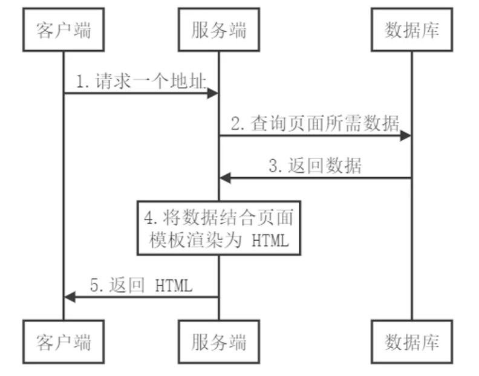
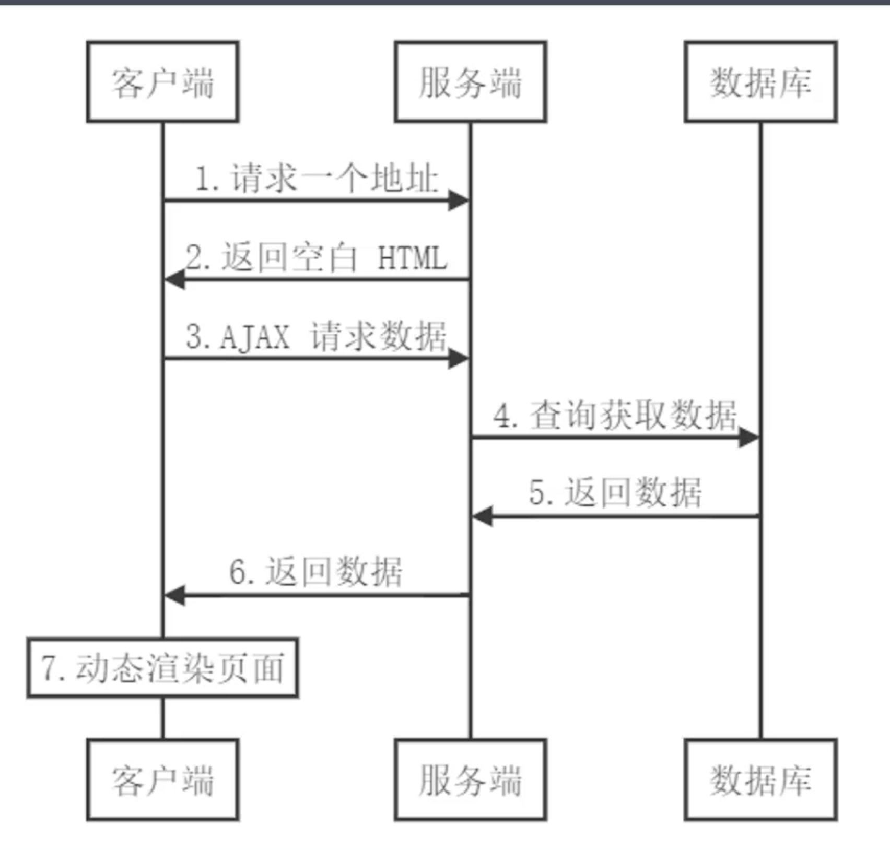
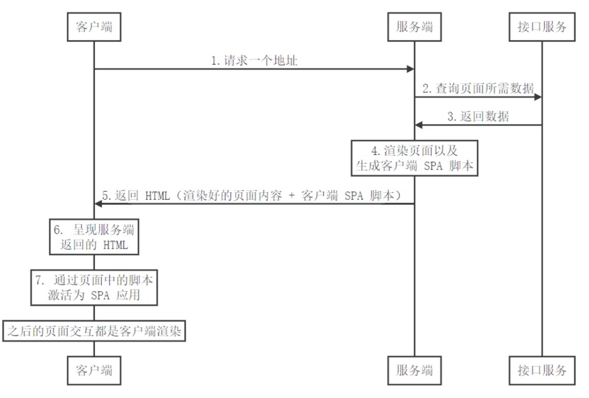

1. SPA应用缺点

   1. 首屏渲染时间长
   2. 不利于SEO
   
2. 同构应用

   1. 通过服务端渲染首屏直出，解决SPA应用首屏渲染慢以及不利于SEO问题
   2. 通过客户端渲染接管页面内容交互得到更好的用户体验
   3. 这种方式通常称之为现代化的服务端渲染，也叫同构渲染。这种方式构建的应用称之为服务端渲染应用或者是同构应用

3. 传统的服务端渲染

   

   1. 前后端代码耦合，不易于开发维护
   2. 前端没有足够发挥空间
   3. 服务端压力大
   4. 用户体验一般

4. 客户端渲染

   

   1. 首屏渲染慢
   2. 不利于SEO

5. 同构渲染（现代化的服务端渲染）

   ​	

   1. 基于React，Vue等框架，客户端渲染和服务端渲染的结合

      1. 在服务端执行一次，用户实现服务端渲染（首屏直出）
      2. 在客户端再执行一次，用户接管页面交互

   2. 核心解决SEO和首屏渲染慢的问题

   3. 拥有传统服务端渲染的优点，也有客户端渲染的优点

   4. 问题

      1. 开发条件有限

         1. 浏览器特定的代码只能在某些生命周期钩子函数中使用
         2. 一些外部扩展库可能需要特殊处理才能在服务端 渲染应用中运行
         3. 不能在服务端渲染期间操作DOM
         4. 某些代码操作需要区分运行环境

      2. 涉及构建和部署的要求更多

      3. |      | 客户端渲染                | 同构渲染                 |
         | ---- | ------------------------- | ------------------------ |
         | 构建 | 仅构建客户端应用即可      | 需要构建两个端           |
         | 部署 | 可以部署在任意Web服务器中 | 只能部署在Node.js Server |

      4. 更多的服务端负载

         1. 在Node中渲染完整的应用程序，相比仅仅提供静态文件的服务器，需要大量占用CPU资源
         2. 如果应用在高流量环境下使用，需要准备相应的服务器负载
         3. 需要更多的服务端渲染优化工作处理

   ----

   

   
