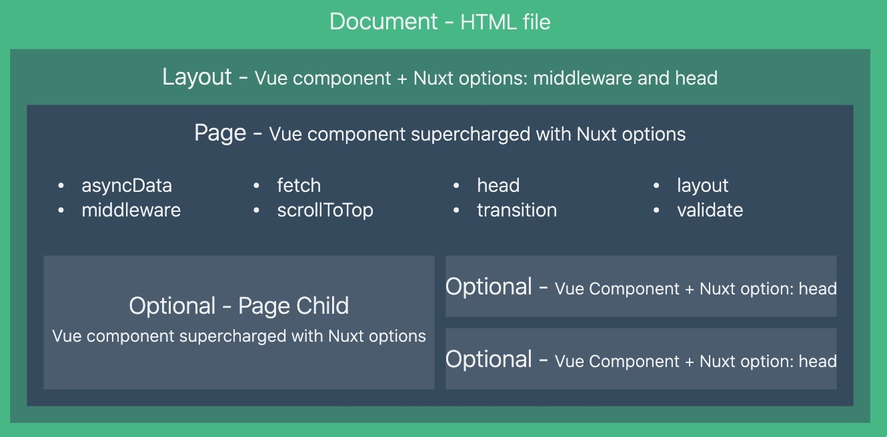

1. SPA应用缺点

   1. 首屏渲染时间长
   2. 不利于SEO
   
2. 同构应用

   1. 通过服务端渲染首屏直出，解决SPA应用首屏渲染慢以及不利于SEO问题
   2. 通过客户端渲染接管页面内容交互得到更好的用户体验
   3. 这种方式通常称之为现代化的服务端渲染，也叫同构渲染。这种方式构建的应用称之为服务端渲染应用或者是同构应用

3. 传统的服务端渲染

   

   1. 前后端代码耦合，不易于开发维护
   2. 前端没有足够发挥空间
   3. 服务端压力大
   4. 用户体验一般

4. 客户端渲染

   

   1. 首屏渲染慢
   2. 不利于SEO

5. 同构渲染（现代化的服务端渲染）

   ​	

   1. 基于React，Vue等框架，客户端渲染和服务端渲染的结合

      1. 在服务端执行一次，用户实现服务端渲染（首屏直出）
      2. 在客户端再执行一次，用户接管页面交互

   2. 核心解决SEO和首屏渲染慢的问题

   3. 拥有传统服务端渲染的优点，也有客户端渲染的优点

   4. 问题

      1. 开发条件有限

         1. 浏览器特定的代码只能在某些生命周期钩子函数中使用
         2. 一些外部扩展库可能需要特殊处理才能在服务端 渲染应用中运行
         3. 不能在服务端渲染期间操作DOM
         4. 某些代码操作需要区分运行环境

      2. 涉及构建和部署的要求更多

      3. |      | 客户端渲染                | 同构渲染                 |
         | ---- | ------------------------- | ------------------------ |
         | 构建 | 仅构建客户端应用即可      | 需要构建两个端           |
         | 部署 | 可以部署在任意Web服务器中 | 只能部署在Node.js Server |

      4. 更多的服务端负载

         1. 在Node中渲染完整的应用程序，相比仅仅提供静态文件的服务器，需要大量占用CPU资源
         2. 如果应用在高流量环境下使用，需要准备相应的服务器负载
         3. 需要更多的服务端渲染优化工作处理

   ----

   Nuxt

    1. 路由

        	1. 通过a链接，会导致刷新，走服务端渲染
        	2. 通过<router-link>，和vue中的类似
        	3. 编程式导航，在methods中调用this.$router.push，和vue中的类似

    2. 动态路由

        1. 在pages下的路由文件夹中，以下划线开头命名

           ```
           pages/
           --| _slug/
           -----| comments.vue
           -----| index.vue
           --| users/
           -----| _id.vue
           --| index.vue
           ```

           ```js
           router: {
             routes: [
               {
                 name: 'index',
                 path: '/',
                 component: 'pages/index.vue'
               },
               {
                 name: 'users-id',
                 path: '/users/:id?',
                 component: 'pages/users/_id.vue'
               },
               {
                 name: 'slug',
                 path: '/:slug',
                 component: 'pages/_slug/index.vue'
               },
               {
                 name: 'slug-comments',
                 path: '/:slug/comments',
                 component: 'pages/_slug/comments.vue'
               }
             ]
           }
           ```

   	3. 嵌套路由

       	1. 创建内嵌子路由，需要添加一个Vue文件，同时添加一个与该文件同名的目录来存放子视图文件

       	2. ```
           pages/
           --| users/
           -----| _id.vue
           -----| index.vue
           --| users.vue
           ```

       	3. Warning: 别忘了在父组件(.vue文件) 内增加 <nuxt-child/> 用于显示子视图内容。

   	4. 自定义路由配置

   	5. 视图Layout：https://zh.nuxtjs.org/guide/views

       

       1. 自定义html模板
       2. 扩展默认布局，类似于一个更简便的嵌套路由

   	6. 异步数据asyncData

       	1. 在服务端会调用，客户端路由更新前调用（同构渲染）
       	2. 只能在页面组件中(pages)使用，如果要在子组件中使用，只能在page中获取再props传
       	3. 没有this，是在组件初始化之前被调用的，但可通过第一个参数context，获取一些上下文信息，如params

   
